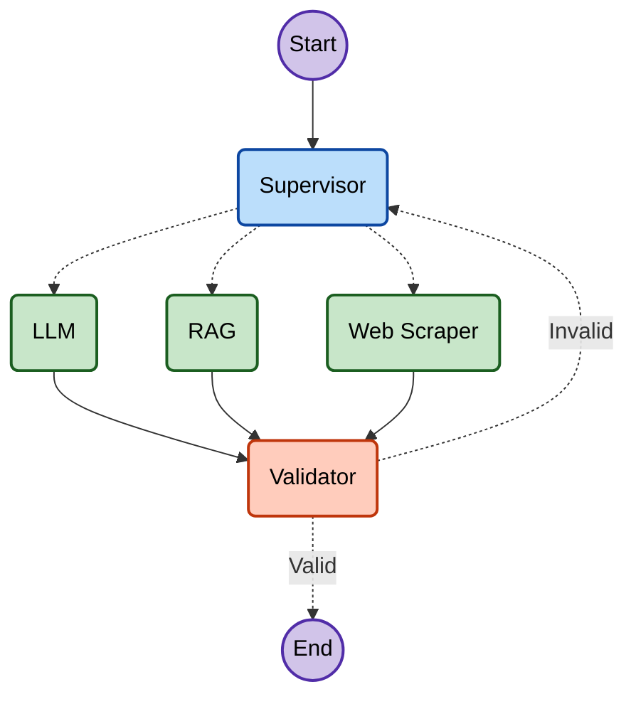

# VeriGraph-AI 🛡️

**VeriGraph-AI** is an advanced agentic AI system built with **LangGraph** and **LangChain** that orchestrates a team of specialized AI workers to answer complex user queries. The system features an intelligent supervisor that routes tasks, a Retrieval-Augmented Generation (RAG) engine, real-time web scraping capabilities, and a robust validation loop to ensure high-quality responses.

## 🚀 Features

- **Supervisor-Worker Architecture**: A central supervisor node analyzes user intent and routes queries to the most appropriate worker.
- **Specialized Workers**:
  - **🤖 LLM Node**: Handles general conversational queries and logic using Groq.
  - **📚 RAG Node**: Retrieves precise information from a local knowledge base (e.g., US Economy data) using ChromaDB and HuggingFace embeddings.
  - **🌐 Web Scraper Node**: Fetches real-time information from the internet using the Tavily Search API.
- **✅ Self-Correction & Validation**: A dedicated validator node reviews all outputs. If an answer is deemed invalid or insufficient, it rejects the result and triggers a retry or alternative routing.
- **State Management**: Built on `LangGraph`'s `StateGraph` to maintain robust conversation state and handle complex cyclic workflows.

## 🏗️ Architecture

The system operates as a directed graph where:
1.  **Supervisor** receives the user query.
2.  **Router** directs the flow to `LLM`, `RAG`, or `Web Scraper` based on the supervisor's decision.
3.  **Worker** executes the task and generates a response.
4.  **Validator** evaluates the response against the original query.
    -   If **Valid**: The workflow ends and returns the result.
    -   If **Invalid**: The workflow loops back to the Supervisor to attempt a different approach.



## 🛠️ Prerequisites

- **Python 3.12+**
- **Jupyter Notebook** (to run the core logic)
- API Keys for:
  - [Groq](https://console.groq.com/) (LLM inference)
  - [Tavily](https://tavily.com/) (Web Search)
  - [HuggingFace](https://huggingface.co/) (Embeddings)
  - [LangSmith](https://smith.langchain.com/) (Optional, for tracing)

## 📦 Installation

1.  **Clone the Repository**
    ```bash
    git clone https://github.com/yourusername/verigraph-ai.git
    cd verigraph-ai
    ```

2.  **Install Dependencies**
    It is recommended to use a virtual environment.
    ```bash
    # Using pip
    pip install -r requirements.txt
    
    # Or if using uv/poetry (based on pyproject.toml)
    pip install .
    ```

3.  **Set Up Environment Variables**
    Create a `.env` file in the `code/` directory or project root with the following keys:
    ```env
    GROQ_API_KEY=your_groq_api_key
    TAVILY_API_KEY=your_tavily_api_key
    HUGGINGFACE_API_KEY=your_huggingface_api_key
    LANGCHAIN_API_KEY=your_langchain_api_key
    LANGCHAIN_TRACING_V2=true
    LANGCHAIN_PROJECT=VeriGraph-AI
    ```

## 🚀 Usage

Run the Streamlit application locally from the repository root:

```bash
streamlit run main.py
```

The workflow is implemented in `code/workflow.py` and its prompt templates are in
`code/prompts.py`. The production application runs from `main.py`; notebooks are
not required for deployment.

## 🐳 Docker and Kubernetes deployment

The repository includes a Docker image that starts the Streamlit app on port `8501`.

Build and run it locally:

```bash
docker build -t verigraph-ai:latest .
docker run --rm -p 8501:8501 \
    -e GROQ_API_KEY=your_groq_api_key \
    -e TAVILY_API_KEY=your_tavily_api_key \
    verigraph-ai:latest
```

On a single-node Kubernetes VM, build the image on the VM (or push it to a registry and update `image` in `kubernetes.yaml`), then create the secret and deploy:

```bash
kubectl create secret generic verigraph-ai-secrets \
    --from-literal=GROQ_API_KEY='your_groq_api_key' \
    --from-literal=TAVILY_API_KEY='your_tavily_api_key' \
    --from-literal=HUGGINGFACE_API_KEY='your_huggingface_api_key' \
    --from-literal=LANGCHAIN_API_KEY='your_langchain_api_key'
kubectl apply -f kubernetes.yaml
kubectl get pods -l app=verigraph-ai
```

Open `http://<VM_PUBLIC_IP>:30851`. The VM firewall/security group must allow inbound TCP port `30851`.

## 📂 Project Structure

```
verigraph-ai/
├── main.py                 # Streamlit entry point
├── code/
│   ├── workflow.py         # LangGraph workflow
│   ├── prompts.py          # Prompt templates
│   └── __init__.py          # Application package marker
├── data/
│   └── usa.txt               # Knowledge base for RAG
├── pyproject.toml            # Project dependencies
├── README.md                 # Project documentation
└── .env                      # Environment variables (not committed)
```

## 🤝 Contributing

Contributions are welcome! Please feel free to submit a Pull Request.

## 📄 License

This project is open-source and available under the [MIT License](LICENSE).
